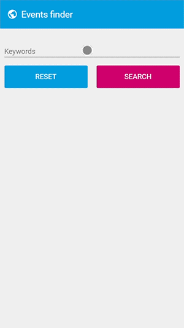

# Polymer3-ticketmaster

Application simple permettant de récupérer une liste d'événements et d'en afficher les détails, créé pour tester Polymer 3 et l'API REST de Ticketmaster (https://developer.ticketmaster.com/). Attention, il est nécessaire de créer un compte et une clée d'API valide pour que l'application puisse recevoir les données de Ticketmaster.

### Interface

    

### Lancement

##### Prérequis

Installer [Polymer CLI](https://github.com/Polymer/polymer-cli) avec
[npm](https://www.npmjs.com) (on suppose que node.js est déjà installé [node.js](https://nodejs.org)). 
Configurer <i>ticketmaster-api.json</i> avec une clée d'API Ticketmaster valide

    npm install -g polymer-cli@next

### Lancer le serveur

La commande suivante lance l'application à l'adresse `http://127.0.0.1:8081` :

    npm start
   
